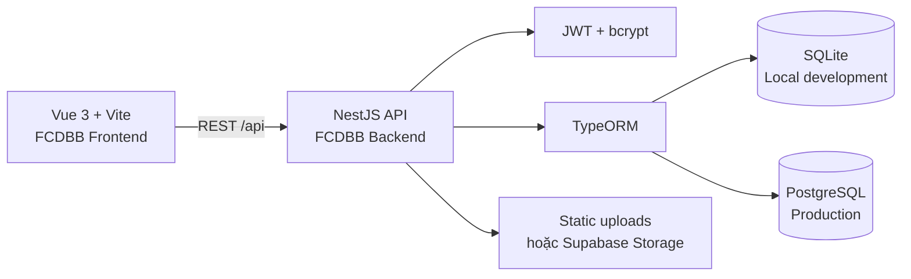

# FC Đá Bay Bóng

<p align="center">
  <strong>FCDBB — Football Club Digital Base</strong><br />
  Nền tảng vận hành đội bóng, kết nối cầu thủ, lịch thi đấu, điểm danh, quỹ đội và blog nội bộ trong một trải nghiệm thống nhất.
</p>

<p align="center">
  <a href="https://github.com/LuongNuong131/LuNu_FCDBB"></a>
  
  
  
  
</p>

> **FCDBB** không chỉ là một trang blog. Đây là “phòng điều hành số” của đội bóng: nơi thông tin được cập nhật, hoạt động được ghi nhận và mọi thành viên có thể theo dõi hành trình chung của FC một cách rõ ràng, nhanh chóng và có tổ chức.

## Mục lục

- [Tổng quan](#tổng-quan)
- [Điểm nổi bật](#điểm-nổi-bật)
- [Kiến trúc hệ thống](#kiến-trúc-hệ-thống)
- [Công nghệ sử dụng](#công-nghệ-sử-dụng)
- [Cấu trúc thư mục](#cấu-trúc-thư-mục)
- [Yêu cầu môi trường](#yêu-cầu-môi-trường)
- [Khởi chạy nhanh](#khởi-chạy-nhanh)
- [Cấu hình môi trường](#cấu-hình-môi-trường)
- [Tài khoản phát triển](#tài-khoản-phát-triển)
- [API chính](#api-chính)
- [Quản trị blog](#quản-trị-blog)
- [Kiểm thử và build](#kiểm-thử-và-build)
- [Triển khai](#triển-khai)
- [Bảo mật](#bảo-mật)
- [Xử lý sự cố](#xử-lý-sự-cố)
- [Định hướng phát triển](#định-hướng-phát-triển)
- [Đóng góp](#đóng-góp)
- [Giấy phép](#giấy-phép)

## Tổng quan

FCDBB là ứng dụng web dành cho một đội bóng phong trào hoặc bán chuyên. Giao diện được xây dựng theo hướng dashboard hiện đại, ưu tiên thao tác nhanh trên máy tính và thiết bị di động. Thành viên có thể đăng nhập, xem hồ sơ, theo dõi cầu thủ, lịch đấu, điểm danh và tình hình quỹ. Tài khoản quản trị có thêm quyền điều hành dữ liệu đội bóng và biên tập nội dung blog.

Phiên bản hiện tại được tổ chức theo mô hình **frontend–backend tách rời**. Frontend Vue 3 gọi REST API từ backend NestJS. Khi phát triển local, backend tự động sử dụng SQLite thông qua `better-sqlite3`, vì vậy không cần dựng PostgreSQL hay Supabase chỉ để chạy thử giao diện. Khi triển khai thực tế, hệ thống có thể chuyển sang PostgreSQL bằng biến môi trường `DATABASE_URL`.

## Điểm nổi bật

| Khu vực | Chức năng |
| --- | --- |
| **Trang chủ** | Hiển thị trận đang hoạt động, lịch sử gần nhất và trạng thái điểm danh. |
| **Hồ sơ cầu thủ** | Quản lý thông tin cá nhân, chỉ số thể chất, vị trí, avatar và mật khẩu. |
| **Danh sách cầu thủ** | Tra cứu thành viên, vai trò và thông tin cơ bản trong đội. |
| **Lịch thi đấu** | Tạo, cập nhật, xóa trận đấu; quản lý địa điểm và các mốc thời gian. |
| **Điểm danh** | Xác thực thời gian, khoảng cách tới sân và trạng thái đúng giờ/đi muộn. |
| **Quỹ đội** | Theo dõi khoản thu, khoản chi, lý do và ảnh minh chứng. |
| **Blog nội bộ** | Đọc bài viết; admin tạo, sửa, xóa bài và tải ảnh minh họa. |
| **Xác thực** | Đăng nhập bằng JWT, phân quyền admin/user và băm mật khẩu bằng bcrypt. |
| **Lưu trữ ảnh** | Local storage khi phát triển; Supabase Storage khi có cấu hình production. |

## Kiến trúc hệ thống



Frontend mặc định gọi API tại `http://localhost:3000/api`. Backend phục vụ các route dưới prefix `/api`, đồng thời phục vụ ảnh local từ thư mục `fcdbb-backend/public`.

## Công nghệ sử dụng

| Thành phần | Công nghệ |
| --- | --- |
| **UI** | Vue 3, Vue Router, Tailwind CSS |
| **Build tool** | Vite |
| **HTTP client** | Axios |
| **API server** | NestJS 11, Express |
| **ORM** | TypeORM |
| **Authentication** | JWT, bcrypt |
| **Local database** | better-sqlite3 |
| **Production database** | PostgreSQL, tương thích Supabase |
| **Object storage** | Local `public/uploads` hoặc Supabase Storage |
| **Ngôn ngữ** | JavaScript, TypeScript |

## Cấu trúc thư mục

```text
LuNu_FCDBB/
├── fcdbb-backend/
│   ├── src/
│   │   ├── fcdbb/
│   │   │   ├── entities/          # TypeORM entities
│   │   │   ├── fcdbb.controller.ts# REST endpoints
│   │   │   ├── fcdbb.module.ts    # Feature module + JWT
│   │   │   └── fcdbb.service.ts   # Business logic
│   │   ├── app.module.ts          # Database, config, static files
│   │   └── main.ts                # Bootstrap, CORS, HTTP server
│   ├── public/uploads/             # Ảnh local, không commit ảnh runtime
│   ├── data/                       # SQLite local, không commit database
│   ├── .env.example
│   └── package.json
├── fcdbb-frontend/
│   ├── src/
│   │   ├── components/            # Toast, dialog, date-time field
│   │   ├── views/                 # Home, Login, Blog, Admin, ...
│   │   ├── api.js                 # Axios client dùng chung
│   │   ├── router.js               # Route và route guard
│   │   └── style.css               # Design system của ứng dụng
│   ├── public/
│   ├── .env.example
│   └── package.json
└── README.md
```

## Yêu cầu môi trường

| Thành phần | Phiên bản khuyến nghị |
| --- | --- |
| Node.js | 20 LTS trở lên; Node.js 22 được khuyến nghị |
| npm | 10 trở lên |
| Git | Phiên bản hiện đại có hỗ trợ clone repository |
| PostgreSQL/Supabase | Không bắt buộc khi chạy local |

## Khởi chạy nhanh

### 1. Clone repository

```bash
git clone https://github.com/LuongNuong131/LuNu_FCDBB.git
cd LuNu_FCDBB
```

### 2. Cài dependency cho backend

```bash
cd fcdbb-backend
npm install
cp .env.example .env
```

Nếu bạn không điền `DATABASE_URL`, backend sẽ tự tạo database SQLite tại `fcdbb-backend/data/fcdbb.sqlite`. Đây là lựa chọn mặc định nhằm giúp dự án chạy được ngay sau khi clone.

### 3. Cài dependency cho frontend

Mở terminal thứ hai tại thư mục gốc của repository:

```bash
cd fcdbb-frontend
npm install
cp .env.example .env
```

### 4. Chạy backend

```bash
cd fcdbb-backend
npm run start:dev
```

Backend sẽ chạy tại `http://localhost:3000`. Kiểm tra nhanh bằng:

```bash
curl http://localhost:3000/api/ping
```

Kết quả hợp lệ có dạng:

```json
{
  "status": "awake",
  "time": "2026-08-21T00:00:00.000Z"
}
```

### 5. Chạy frontend

Ở terminal thứ hai:

```bash
cd fcdbb-frontend
npm run dev
```

Truy cập địa chỉ Vite hiển thị trên terminal, thông thường là `http://localhost:5173`.

## Cấu hình môi trường

### Backend: `fcdbb-backend/.env`

| Biến | Bắt buộc | Mô tả |
| --- | --- | --- |
| `PORT` | Không | Cổng HTTP, mặc định `3000`. |
| `JWT_SECRET` | Production | Secret dùng để ký JWT; phải thay giá trị mẫu trước khi deploy. |
| `DATABASE_URL` | Production | Chuỗi kết nối PostgreSQL. Bỏ trống để dùng SQLite local. |
| `SQLITE_DB_PATH` | Không | Đường dẫn database local, mặc định `data/fcdbb.sqlite`. |
| `SUPABASE_URL` | Tùy chọn | Project URL của Supabase để lưu ảnh cloud. |
| `SUPABASE_KEY` | Tùy chọn | Key của Supabase Storage. |
| `CORS_ORIGINS` | Không | Danh sách origin frontend, phân tách bằng dấu phẩy. |
| `TYPEORM_SYNCHRONIZE` | Không | Chỉ bật có chủ đích khi muốn TypeORM đồng bộ schema PostgreSQL. |

### Frontend: `fcdbb-frontend/.env`

```env
VITE_API_URL=http://localhost:3000/api
```

Khi frontend được deploy, thay giá trị này bằng URL backend production có kèm `/api`, ví dụ `https://api.example.com/api`.

## Tài khoản phát triển

Khi database local chưa có user `admin`, backend tự tạo tài khoản quản trị mặc định:

| Trường | Giá trị |
| --- | --- |
| Username | `admin` |
| Password | `admin123` |
| Role | `admin` |

> Đây chỉ là tài khoản bootstrap cho môi trường phát triển. Hãy đổi mật khẩu ngay sau lần đăng nhập đầu tiên và tuyệt đối không sử dụng thông tin mặc định này trong production.

## API chính

Tất cả endpoint dưới đây dùng prefix `/api`.

| Method | Endpoint | Mục đích | Quyền |
| --- | --- | --- | --- |
| `GET` | `/ping` | Health check chống ngủ đông/kiểm tra server. | Public |
| `POST` | `/auth/login` | Đăng nhập và nhận JWT. | Public |
| `GET` | `/users` | Lấy danh sách cầu thủ. | App |
| `GET` | `/users/:id` | Lấy hồ sơ một cầu thủ. | App |
| `PUT` | `/users/:id` | Cập nhật hồ sơ. | App/Admin |
| `POST` | `/users/:id/avatar` | Tải avatar với multipart field `file`. | App |
| `GET` | `/home` | Lấy trận đang hoạt động và lịch sử gần nhất. | App |
| `GET` | `/matches` | Lấy danh sách trận đấu. | App/Admin |
| `POST` | `/attendance/checkin` | Điểm danh theo tọa độ GPS. | App |
| `GET` | `/funds` | Lấy sổ quỹ đội. | App/Admin |
| `GET` | `/blog` | Lấy các bài blog mới nhất. | App |
| `POST` | `/blog` | Tạo bài viết dạng multipart. | Admin |
| `PUT` | `/blog/:id` | Cập nhật bài viết. | Admin |
| `DELETE` | `/blog/:id` | Xóa bài viết. | Admin |

Các route quản trị blog cần gửi header:

```http
Authorization: Bearer <jwt-token>
```

Khi tạo hoặc cập nhật bài viết, frontend gửi `multipart/form-data` với các field `title`, `excerpt`, `content` và tùy chọn `image`.

## Quản trị blog

Blog là khu vực nội dung dùng chung của đội. Người dùng thông thường có thể đọc danh sách bài viết tại `/blog`. Tài khoản admin có thể tạo bài viết mới, chỉnh sửa nội dung, thay ảnh minh họa hoặc xóa bài viết.

Ở môi trường local, ảnh được lưu tại `fcdbb-backend/public/uploads/blog/` và tự động được phục vụ qua URL `/uploads/blog/...`. Khi có đủ `SUPABASE_URL` và `SUPABASE_KEY`, backend chuyển sang upload bucket `uploads` của Supabase mà không cần thay đổi frontend.

## Kiểm thử và build

### Backend

```bash
cd fcdbb-backend
npm run build
npm test
npm run lint
```

### Frontend

```bash
cd fcdbb-frontend
npm run build
npm run preview
```

### Kiểm tra API tối thiểu

```bash
curl http://localhost:3000/api/ping
curl http://localhost:3000/api/blog
curl -X POST http://localhost:3000/api/auth/login \
  -H 'Content-Type: application/json' \
  -d '{"username":"admin","password":"admin123"}'
```

## Triển khai

### Backend

Backend phù hợp với Render, Railway, Fly.io hoặc một máy chủ Node.js thông thường. Thiết lập build command là `npm install && npm run build`, start command là `npm run start:prod`, working directory là `fcdbb-backend` và truyền các biến môi trường production tương ứng.

Khi dùng PostgreSQL, đặt `DATABASE_URL` và cân nhắc quy trình migration riêng trước khi bật ứng dụng. Không nên bật `TYPEORM_SYNCHRONIZE=true` trên production nếu database chứa dữ liệu quan trọng.

### Frontend

Frontend phù hợp với Vercel, Netlify hoặc static hosting bất kỳ. Working directory là `fcdbb-frontend`, build command là `npm run build`, output directory là `dist`. Biến `VITE_API_URL` phải trỏ tới backend production với prefix `/api`.

Ứng dụng dùng `createWebHistory`, vì vậy static host cần cấu hình fallback mọi route về `index.html` để các URL như `/blog`, `/players` và `/admin` không trả về lỗi 404 khi refresh.

## Bảo mật

Phiên đăng nhập sử dụng JWT và mật khẩu được băm bằng bcrypt. Backend không trả password hash trong các response user, kể cả response đăng nhập. Quyền quản trị blog được kiểm tra từ token trước khi tạo, sửa hoặc xóa nội dung.

Trong production, hãy thay `JWT_SECRET`, giới hạn `CORS_ORIGINS` về đúng domain frontend, bảo vệ các biến Supabase/PostgreSQL, bật HTTPS và đặt reverse proxy hoặc platform policy phù hợp. Dữ liệu trong `.env`, database local và ảnh runtime không được commit vào Git.

## Xử lý sự cố

| Hiện tượng | Nguyên nhân thường gặp | Cách xử lý |
| --- | --- | --- |
| Frontend báo Network Error | Backend chưa chạy hoặc `VITE_API_URL` sai. | Kiểm tra `npm run start:dev`, `/api/ping` và giá trị `.env`. |
| Backend không khởi động | Port `3000` đang bị chiếm. | Đổi `PORT` hoặc dừng process đang dùng port. |
| Không đăng nhập được | Sai thông tin hoặc database cũ chứa user khác. | Dùng `admin/admin123` ở database local mới; không xóa database production. |
| Ảnh không hiển thị | URL backend không truy cập được từ frontend. | Kiểm tra `image_url`, CORS và static path `/uploads`. |
| Refresh `/blog` bị 404 | Hosting chưa cấu hình SPA fallback. | Chuyển mọi route frontend về `index.html`. |
| Upload cloud lỗi | Thiếu hoặc sai biến Supabase. | Kiểm tra `SUPABASE_URL`, `SUPABASE_KEY` và bucket `uploads`. |

## Định hướng phát triển

Các bước tiếp theo có thể tập trung vào việc bổ sung DTO và validation schema bằng `class-validator`, đưa các route quản trị vào guard JWT thống nhất, bổ sung migration TypeORM, thêm phân trang blog, thêm tìm kiếm/lọc bài viết, viết test e2e cho luồng điểm danh và tích hợp CI để tự động build frontend/backend sau mỗi pull request.

## Đóng góp

Mọi thay đổi nên được thực hiện trên một branch riêng. Hãy giữ commit nhỏ, mô tả rõ mục tiêu, chạy build của cả hai ứng dụng trước khi mở pull request và không đưa secrets, database local hoặc ảnh runtime vào commit.

```bash
git checkout -b feat/ten-thay-doi
git add .
git commit -m "feat: mo ta thay doi"
git push -u origin feat/ten-thay-doi
```

## Giấy phép

Repository hiện chưa khai báo một giấy phép mã nguồn mở ở cấp root. Nếu dự án được phát hành công khai, hãy bổ sung file `LICENSE` và ghi rõ phạm vi sử dụng trước khi phân phối.

## Tham khảo

- [Vue.js Documentation](https://vuejs.org/guide/introduction.html)
- [Vite Documentation](https://vite.dev/guide/)
- [NestJS Documentation](https://docs.nestjs.com/)
- [TypeORM Documentation](https://typeorm.io/)
- [Supabase Storage Documentation](https://supabase.com/docs/guides/storage)
